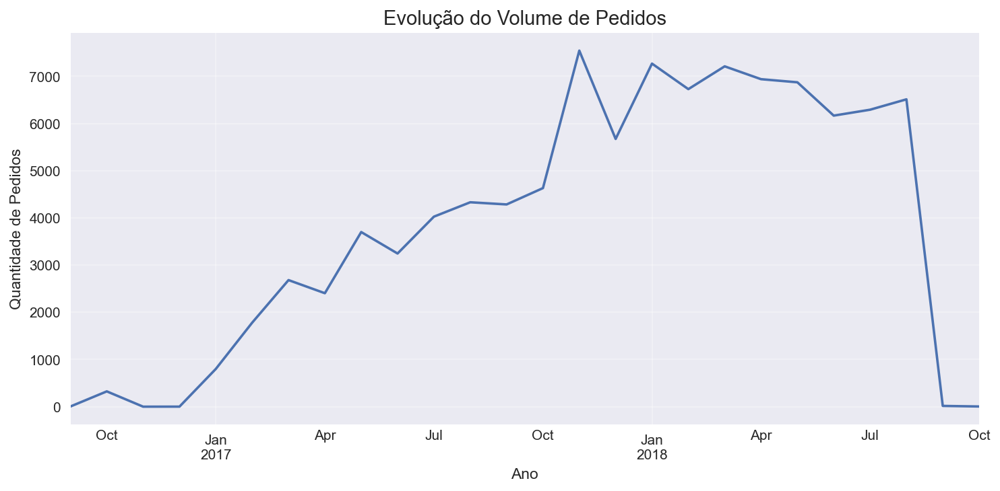
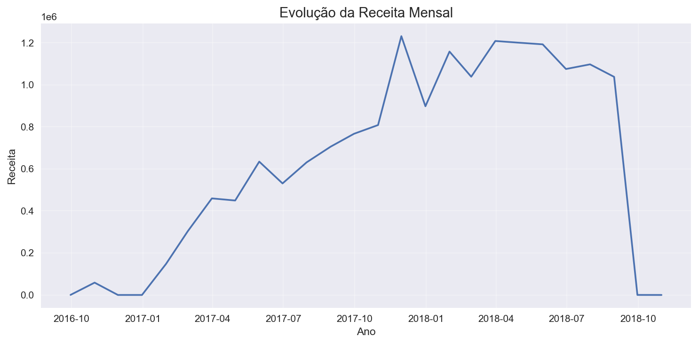
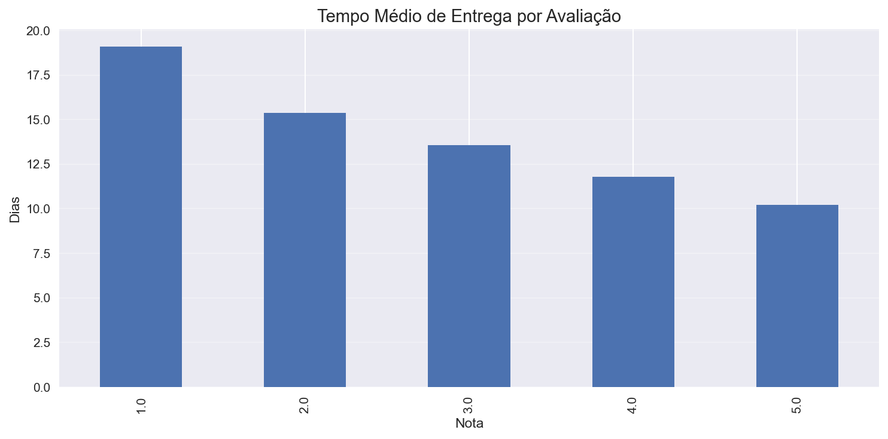
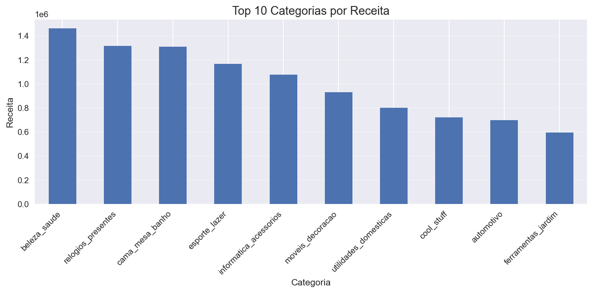

📌 Visão Geral

Este projeto realiza uma Análise Exploratória de Dados (EDA) utilizando dados reais de um e-commerce brasileiro, disponibilizados pela Olist.
O objetivo é compreender padrões de vendas, comportamento dos clientes, desempenho logístico e sua relação com a satisfação do consumidor, aplicando boas práticas de análise de dados e storytelling analítico.

O projeto foi desenvolvido com foco em clareza, organização e geração de insights de negócio, simulando um cenário real de atuação como Analista de Dados.

🗂️ Base de Dados

Fonte: Kaggle — Brazilian E-Commerce Public Dataset by Olist

Formato: CSV

Período: 2016 a 2018

Principais tabelas utilizadas:

orders

customers

order_items

products

payments

reviews

🎯 Objetivos da Análise

Analisar a evolução do volume de pedidos e da receita ao longo do tempo

Identificar categorias de produtos mais relevantes em termos de volume e faturamento

Avaliar padrões de comportamento dos clientes

Investigar o impacto do tempo de entrega na satisfação do cliente

Gerar insights acionáveis para apoio à tomada de decisão

🔧 Etapas do Projeto

Entendimento do contexto de negócio e do dataset

Carregamento e validação das tabelas

Tratamento de dados e conversão de tipos

Integração das tabelas em uma base analítica única

Criação de métricas de negócio (receita, ticket médio)

Análise exploratória e temporal

Análise logística e relação com avaliações

Análise por categoria de produto

Geração de insights e conclusão executiva

📊 Principais Análises Realizadas

## 📈 Exemplos de Análises

### Evolução do Volume de Pedidos

### Evolução da Receita Mensal

### Logística e Avaliação do Cliente

### Categorias com Maior Receita

Evolução do volume de pedidos ao longo do tempo

Evolução da receita mensal e identificação de sazonalidade

Receita total e ticket médio

Análise do tempo de entrega

Relação entre prazo de entrega e nota de avaliação

Volume e receita por categoria de produto

Comparação entre categorias de alto volume e alto valor agregado

🧠 Principais Insights

O volume de pedidos e a receita apresentaram crescimento ao longo do período analisado

Existe sazonalidade na receita, indicando meses com maior concentração de vendas

Algumas categorias possuem alto volume de pedidos, mas menor valor agregado

Outras categorias, mesmo com menor volume, contribuem significativamente para a receita

Pedidos com maior tempo de entrega tendem a receber avaliações mais baixas, reforçando a logística como fator crítico para a satisfação do cliente

🛠️ Ferramentas Utilizadas

Python

Pandas

NumPy

Matplotlib

Seaborn

Jupyter Notebook

Git & GitHub

📈 Conclusão

A análise exploratória permitiu identificar padrões relevantes de vendas, comportamento dos clientes e gargalos logísticos.
Os resultados demonstram que melhorias nos prazos de entrega, otimização do mix de produtos e planejamento baseado em sazonalidade podem gerar impactos positivos tanto na receita quanto na experiência do cliente.

Este projeto demonstra a aplicação prática de técnicas de análise de dados em um cenário real de e-commerce, com foco em geração de valor para o negócio.

📎 Observação

Projeto desenvolvido com fins educacionais e demonstrativos, utilizando dados públicos, com foco no desenvolvimento de habilidades práticas em análise de dados e storytelling analítico.
